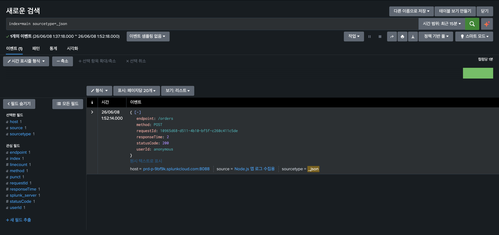

# Splunk_AWS_Data_analyze

AWS 환경에서 Splunk를 연동하여 애플리케이션 로그를 수집, 분석 및 모니터링하는 프로젝트입니다.

## 프로젝트 목표

* AWS 환경에서 애플리케이션 운영
* Splunk를 활용한 로그 수집 및 중앙 관리
* 실시간 로그 모니터링 및 분석
* 장애 발생 시 신속한 원인 분석 및 대응
* 로그 기반 데이터 시각화 및 인사이트 도출

## 프로젝트 구조

```text
Splunk_AWS/
├── splunk-log-project/
│   └── backend/
├── frontend/
├── infra/
├── splunk/
├── docs/
├── README.md
└── .gitignore
```

## 기술 스택

* AWS
* Terraform
* Splunk Cloud
* Node.js
* Express
* Docker

## 주요 기능

* REST API 기반 주문 생성
* 요청 및 응답 로그 기록
* 에러 로그 수집
* Splunk HTTP Event Collector(HEC) 연동
* 로그 검색 및 대시보드 시각화

## 실행 방법

### Backend 실행

```bash
cd splunk-log-project/backend
npm install
npm run dev
```

### API 테스트

```bash
curl -X POST http://localhost:3000/orders \
-H "Content-Type: application/json" \
-d '{"item":"keyboard","quantity":2}'

```
splunk 검색 : index=main sourcetype=_json


## 향후 계획

* AWS EC2 배포
* Docker 기반 컨테이너 환경 구축
* Splunk Dashboard 구성
* CloudWatch 연동
* CI/CD 파이프라인 구축

```
```
